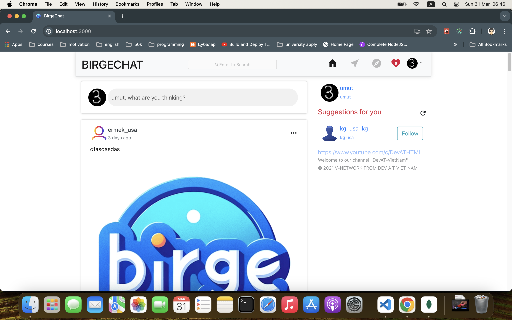

# BirgeChat

BirgeChat is a full-stack social media application inspired by Instagram, built with the MERN stack (MongoDB, Express.js, React, Node.js). It features user authentication, real-time chats, post creation and deletion, likes, comments, and much more.

## Features

- User authentication with JWT and refresh tokens
- Real-time chat using Socket.io
- Image and video uploads
- Post creation, update, and deletion
- Commenting on posts
- Liking posts
- User profile creation and edits
- Following and unfollowing users
- Search functionality for discovering posts and profiles
- Responsive design for various devices and screen sizes

## Tech Stack

- MongoDB: NoSQL database for storing user and post data
- Express.js: Backend framework for Node.js
- React: Frontend library for building the user interface
- Node.js: JavaScript runtime environment for the backend
- Redux & Redux Thunk: State management tools for React
- Socket.io: Enables real-time bidirectional event-based communication
- Bcrypt: For hashing and securing user passwords
- JWT: For secure transmission of user information as a JSON object

## Installation

### Prerequisites

- Node.js
- npm or yarn
- MongoDB

### Setting up the backend

1. Clone the repository to your local machine.
2. Navigate to the `server` directory.
3. Install the dependencies with `npm install`.
4. Create a `.env` file in the root of the `server` directory with the following keys:
   - MONGO_URI: Your MongoDB URI
   - JWT_SECRET: Secret key for JWT
   - PORT: The port you want the server to run on (default is 5000)
5. Start the server with `npm run dev`.

### Setting up the frontend

1. Navigate to the `client` directory.
2. Install the dependencies with `npm install`.
3. Start the React app with `npm start`.

## Usage

After setting up both the server and the client, you can access BirgeChat at `http://localhost:3000` (or whatever port you have specified).

## Contributing

Contributions are welcome! Please feel free to submit a pull request.

## License

This project is open-sourced under the ISC license.

## Acknowledgments

A special thanks to all the contributors and mentors who have helped with the development of BirgeChat.
